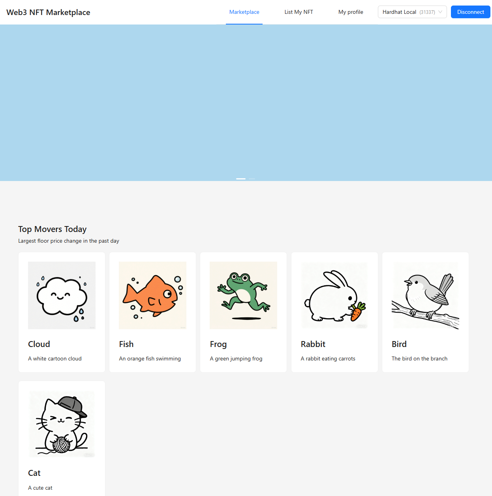
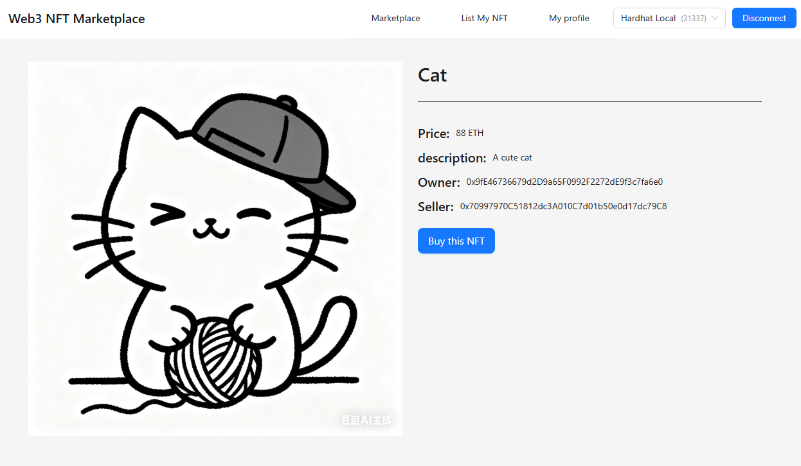
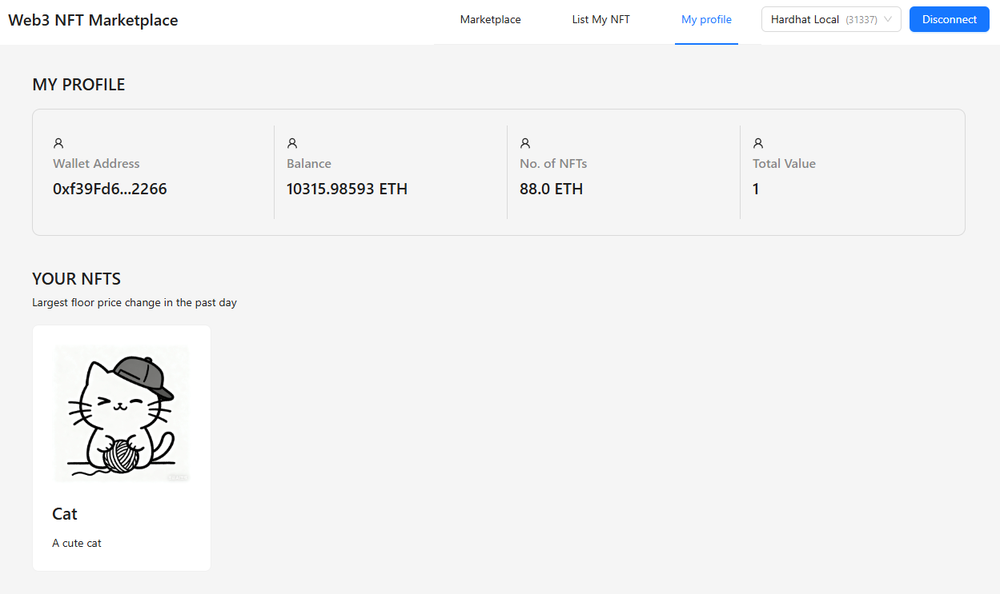
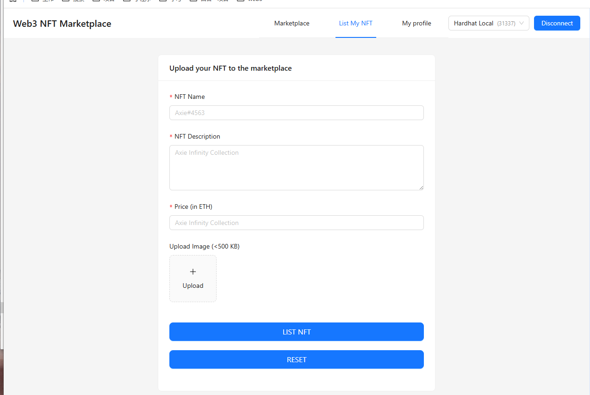

# Web3 NFT Marketplace 项目文档

一个基于 React + Vite + Reown AppKit + Ethers.js 构建的现代化 NFT 市场平台，支持 NFT 创建、交易、展示等核心功能，提供完整的 Web3 用户交互体验。

## 📝 项目概述

本项目是一套功能闭环的 NFT 市场解决方案，覆盖从 NFT 铸造到交易的全流程，用户可实现以下核心操作：

- 浏览平台内所有可售 NFT，查看详情与实时价格

- 创建个人 NFT（上传资源、填写元数据）并上架出售

- 管理个人 NFT 
## 📸 项目截图

### 市场页面


### 出售 NFT 页面


### 个人资料页面


### 上架 NFT 页面



## 🛠️ 技术栈

### 前端框架

- **React 18.3.1**：轻量且高效的 UI 构建库，支持组件化开发与 Hooks 状态管理
- **TypeScript 5.8.3**：为 JavaScript 提供静态类型检查，提升代码可维护性与安全性
- **Vite 7.1.2**：新一代构建工具，提供极速开发热更新与优化的生产构建能力

### Web3 技术

- **Reown AppKit 1.8.2**：多钱包连接聚合方案，支持 MetaMask、Coinbase Wallet 等主流钱包
- **Ethers.js 6.15.0**：以太坊生态核心交互库，处理合约调用、签名、余额查询等区块链操作
- **Hardhat**：智能合约开发与测试环境，支持本地节点启动、合约编译与部署

### UI 组件库

- **Ant Design 5.27.3**：企业级 UI 组件库，提供响应式布局、表单、弹窗等开箱即用组件
- **React Router DOM 7.8.2**：客户端路由管理工具，实现页面无刷新跳转与路由守卫

### 存储服务

- **Pinata 2.5.0**：IPFS 去中心化文件存储服务，用于存储 NFT 图片与元数据

- **Axios 1.11.0**：HTTP 客户端，处理与 Pinata API、后端服务的请求交互

  

## 🚀 快速开始

- 

### 1. 安装依赖

克隆项目后，在根目录执行以下命令安装依赖：

```bash
# 使用 npm
pnpm install

# 或使用 yarn
yarn install
```

### 2. 环境配置

在项目根目录创建 `.env` 文件，填写以下必要配置项（需自行获取对应密钥 / 地址）：

```env
# Reown AppKit 项目 ID（从 https://reown.com/ 注册获取）
VITE_PROJECT_ID=your_reown_project_id_here

# 智能合约地址（Hardhat 部署后获取的 NFT 市场合约地址）
VITE_CONTRACT_MARKETADDR=0xYourNFTMarketContractAddress
VITE_CONTRACT_USDTADDR=0xYourUSDTContractAddress（如需 USDT 支付）

# Pinata 配置（从 https://www.pinata.cloud/ 控制台获取）
VITE_PINATA_JWT=your_pinata_jwt_token
VITE_PINATA_GATEWAY=your_pinata_gateway_url（如：https://xxx.mypinata.cloud）
```

### 3. 启动开发服务器

#### 步骤 1：启动 Hardhat 本地节点

```bash
# 启动本地测试网络（默认生成 20 个测试账户，含 10000 ETH/账户）
npx hardhat node
```

#### 步骤 2：部署合约
<!-- pnpm add -D hardhat
npx hardhat --init
npx hardhat node
pnpm add @openzeppelin/contracts@^4.7.3 -->
npx hardhat run ./scripts/deploy.ts --network localhost

#### 步骤 3：启动前端开发服务

```bash
npm run dev
```

启动成功后，访问终端输出的本地地址（默认：`http://localhost:5173`）即可进入项目。

### 4. 构建生产版本

当开发完成后，执行以下命令生成优化后的生产构建文件：

```bash
npm run build
```


构建产物会输出到 `dist` 目录，可直接部署到 Nginx、Vercel、Netlify 等平台。

## 

